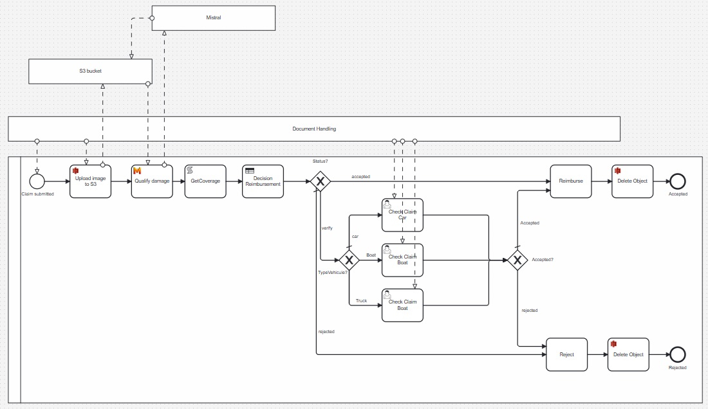
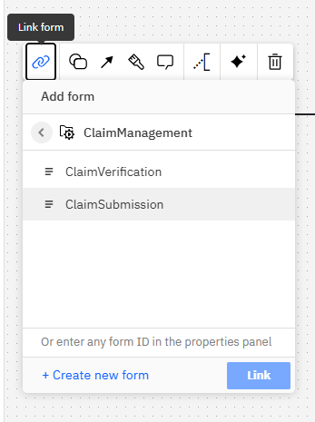

# C8 AI Challenge

An insurance company needs to estimate the cost of vehicle damage. 
The insurer submits an image of the damaged vehicle, and the system initially qualifies the severity of the damage.


Some key that the system have to answer:
* What type of vehicle is it? (Car, Boat, or another category?)
* Is the damage minor (e.g., a small dent) or severe?

# Step-by-Step Guide

## Set Up a Camunda 8 SaaS Environment


Create or use an existing Camunda 8 SaaS account. 

Go to camunda.com and click on the `Try free` button.


Create your account


Complete the different steps.

Choose the Camunda SaaS Trial


The SaaS environment is ready.

Create a Cluster. Select `Cluster` then `Create new cluster`


Give a name (`ClaimManagement`), select a Trial cluster. 
The Camunda 8.7 or upper must be choose for this workshop.


## Build the Process

During this step, we will use AI Copilot to build the process incrementally.

Go to the Modeler, and create a new project. Name it "ClaimManagement"


Create a new process. Name it "ClaimManagement" too


Initial Process Creation:

Ask AI Copilot to generate a process using the following description:

```
A user submits a document. The first step calls an AI service to analyze the document, identifying the vehicle type and estimating the damage cost. If the estimated cost is below $5,000, the application is automatically accepted, and reimbursement proceeds. If the cost exceeds this threshold, the case is assigned to a manual review task, where an operator can accept or reject the application."
```

Refining the Process by adding a Decision Logic:

```shell
Before manual validation, introduce a decision gateway that directs cases to different manual review tasks based on the vehicle type (Car, Boat, or Truck).
```

Add a new step `Get Coverage`

```
Add a service task that checks if the user’s insurance policy covers the identified vehicle type. 
Create a Script taskfor now.
```

The Script task produce a variable `coverage` and the value is hard coded to `basic`.


The process should be


## Reference the AI Connector
Click on he Qualify Damage task. Click on the `Change element` and then select the marketplace icon


Search for the Mistral connector. Download the project.


The Mistral connector is now available


The connector will be specified after.

## Build the DMN table

The result of the DMN table is `status`. It can store three value: 
* `accepted`
* `verify`
* `rejected`

The gateway after will redirect accordind the status


## Build the Submission Form

A form is required for users to submit damage reports. The AI Copilot can assist in creating this form.

Click back on the project, and create a new Form


Rename the form `ClaimSubmission`


AI Copilot Request:
```
Users can upload an image labeled as 'damageImg', a description and comment. 
The contract number, available in the URL parameter 'contractNo', should be displayed as a read-only text field.
```


The result is something like


Check fields are correctly set

| Field           | key         |
|-----------------|-------------|
| Contract Number | contractNo  |
| Description     | description |
| Comments        | comments    |
| Damage file     | damageImg   |


Click on the Connect to diagram button


## Build the Validation Form

This form will be used during the manual review step.

From the project, create a form and name it `ClaimVerification`


AI Copilot Request:
```
In the validation form, display the stored document ('damageImg'). Also, show 'vehicleType' and 'estimateCost' as read-only fields. Include two buttons: 'Accepted' and 'Rejected', which update the process variable 'status'."
```
Additional Requirement:
```
Add a text field named 'comments' where the user can leave remarks. Save this as a document named 'comments'. (Verification needed if this is feasible.)"
```
Final result:


Check fields are correctly set

| Field                 | key                   |
|-----------------------|-----------------------|
| Image preview         | damageImg             |
| Description           | description           |
| Comments              | comments              |
| Vehicle Type          | vehiculeType          |
| Estimate Cost         | estimateCost          | 
| Verification Comments | verificationsComment  | 

## Link forms in the process

Open again the process, and link the form `claimSubmission` on the start event


Link the `ClaimVerification` form in the CheckClaim user task


## Build the DMN table

Create a DMN table in the collection


Give `CheckClaimCost` for the ID


Double-click on the table.
Create these inputs

| Input          | Expression    | 
|----------------|---------------| 
| Vehicule type  | vehiculeType  | 
| estimateCost   | estimateCost  |
| Coverage       | coverage      |

Create this output

| Output          | Expression    | Predefined values                | 
|----------------|---------------|----------------------------------| 
| Vehicule type  | vehiculeType  | "accepted", "rejected","verify"  | 


## Link DMN in the process

Open again the process, and link the table in the process


## Create an Account on Mistral


To be coordinated with William.

## Integrate Mistral AI with the Process


To be coordinated with William.

## Deploy the Process

Once the process is finalized, deploy it in the Camunda 8 SaaS environment.

# Test the Implementation

Provide a collection of test images to verify the workflow and AI functionality.

# Conclusion

By following these steps, you will successfully implement an AI-powered claims processing system in Camunda 8.
