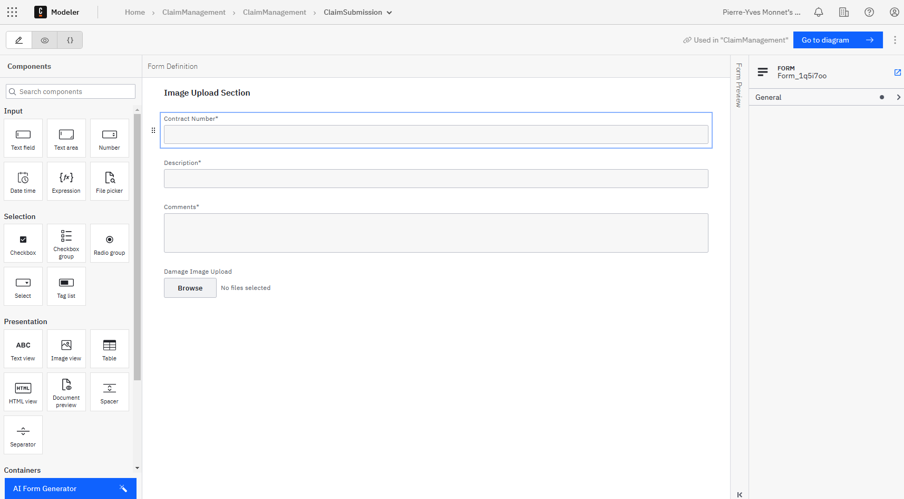
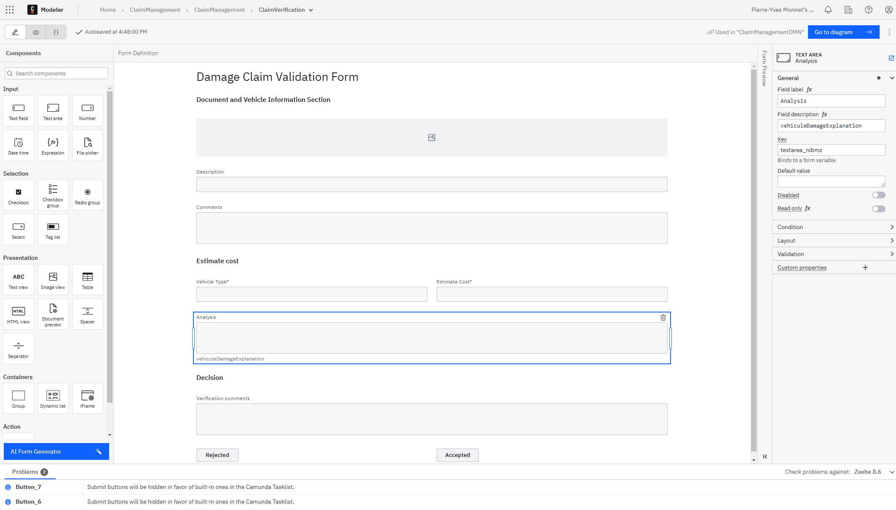
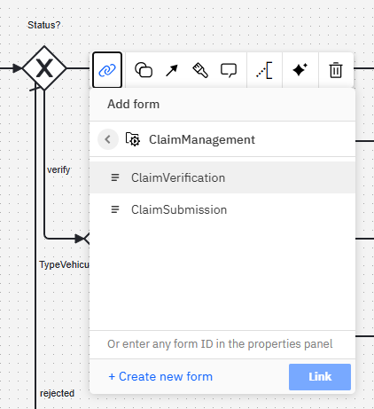
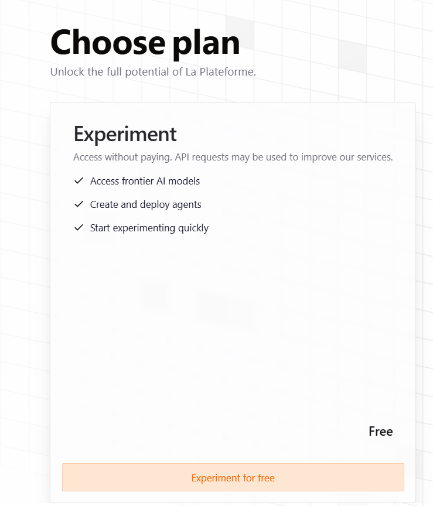

# C8 AI Challenge

An insurance company needs to estimate the cost of vehicle damage.
The insurer submits an image of the damaged vehicle, and the system initially qualifies the severity of the damage.

Some keys that the system has to answer:
* What type of vehicle is it? (Car, Boat, or another category?)
* Is the damage minor (e.g., a small dent) or severe?


The principles are:
* A user submits a document. The document is uploaded in the Document handling of Camunda
* Because the Mistral connector accepts only URLs to access the Image, we need to store the document in a bucket accessible via an HTTP URL. Amazon S3 Bucket offers that. So, the second step consists of copying the document to the S3 Bucket
* The Mistral AI is called to check the Image and return information (type of vehicle, cost of damage)
* The User's coverage is retrieved. We will simulate that part and return a `basic` coverage
* Then, a DMN table is used to make the decision. In many situations, an approval or a rejection can be decided automatically
* If the decision is to be verified by humans, then we will redirect the request to a different team, according to the IA detected
* finally, the application is accepted or rejected

Via this scenario, different feature of Camunda 8 will be used
* Document handling: a user can upload a file in a form, and this document is saved in Camunda
* It's possible to manage this document to export it to a different container (S3 bucket here)
* an AI, Mistral, is integrated and works on the Image uploaded
* DMN table helps to automate some decision
* A user task can display the Image and check the result of the AI


You need, or you will create during this workshop
1. An account on Camunda SaaS
2. An account on AWS
3. An account on Mistral


Follow the different steps.


# 1. Set Up a Camunda 8 SaaS Environment


Create or use an existing Camunda 8 SaaS account.

1.1. Go to camunda.com and click the `Try free` button.


1.2. Create your account


1.3. Complete the different steps.

1.4. Choose the Camunda SaaS Trial


The SaaS environment is ready.

1.5. Check if the AI is enabled


1.6. Create a Cluster. Select `Cluster` then `Create a new cluster.`


1.7 Give a name (`ClaimManagement`), and select a Trial cluster.

1.8 The Camunda 8.7 or upper must be chosen for this workshop.


# 2. Build the Process

We will use AI Copilot to build the process incrementally during this step.


2.1 Go to the Modeler and create a new project. Name it `ClaimManagementProjet`


2.2 Create a new process. Name it `ClaimManagement`


2.3 Ask AI Copilot to generate a process using the following description:

```
A user submits a document. The first step is to call an AI service to analyze the document, identify the vehicle type, and estimate the damage cost. If the estimated cost is below $5,000, the application is automatically accepted, and reimbursement proceeds. If the cost exceeds this threshold, the case is assigned to a manual review task, where an operator can accept or reject the application.
```


2.4 According to the vehicle type, let's dispatch the human verification to three teams.

````
Before manual validation, a decision gateway that directs cases to different manual review tasks based on the vehicle type (Car, Boat, or Truck) should be introduced.
````

2.5 Add a new step, `Get Coverage`

```
After the analysis by the AI, add a service task to retrieve the coverage of the User in a variable "coverage". For the moment, simulate that task with a script task using FEEL.
```

2.6 Add a new step, `Upload to S3.`

Mistral accepts only an external URL, so a connector to upload the file to a public S3 bucket is necessary. At the end of the process, the file is purged from the S3 bucket.

```
We need to upload the file on a public URL for AI. Please add a service task with the connector AWS S3 before the analysis with AI.
```

2.7 Refining the Process by Adding a Decision Logic:

```
I changed my mind. After the coverage task, I want to add a call to a DMN table. The DMN table returns a status of "accepted," "verified," or "rejected," and the decision is made based on the status. Verify the lead to the gateway to select the team.
```

2.8 Purge the S3 file
```
Before the two end events, please add two service tasks using the AWS connector to delete the uploaded file.
```

2.9 Let's precise the rejection

```
When the application is rejected, a "reject" task is necessary just before the end event.
```

2.10 The Script task produces a variable `coverage,` and the value is hard-coded to `basic`.


2.11 The process is at the end:


# 3. Build the Submission Form

Users must submit damage reports using a form. The AI Copilot can assist in creating this form.

3.1 Click back on the project and create a new Form


3.2 Rename the form `ClaimSubmission`


3.3 AI Copilot Request:
```
Users can upload an image labeled 'damageImg', a description, and a comment.
The contract number in the URL parameter 'contractNo' should be displayed as a read-only text field.
```


3.4 The result is something like


3.5 Check fields and widgets are correctly set

| Field           | key         |
|-----------------|-------------|
| Contract Number | contractNo  |
| Description     | description |
| Comments        | comments    |
| Damage file     | damageImg   |


3.6 Click on the Connect to Diagram button


# 4. Build the Validation Form

This form will be used during the manual review step.

4.1 From the project, create a form and name it `ClaimVerification.`


4.2 AI Copilot Request:
```
In the validation form, display the stored document ('damageImg'). Also, show 'vehicleType' and 'estimateCost' as read-only fields. Include two buttons: 'Accepted' and 'Rejected', which update the process variable 'status'."
```

4.3 Additional Requirement:
```
Add a text field named 'comments' where the User can leave remarks. Save this as a document called 'comments'. (Verification needed if this is feasible.)"
```

4.4 Final result:


Check fields are correctly set.

| Field                 | key                        |
|-----------------------|----------------------------|
| Image preview         | damageImg                  |
| Description           | description                |
| Comments              | comments                   |
| Vehicle Type          | vehiculeType               |
| Estimate Cost         | estimateCost               | 
| Analysis              | vehiculeDamageExplanation  | 
| Verification Comments | verificationsComment       | 


# 5. Link forms in the process

5.1 Open the process again and link the claim claimSubmission form to the start event. To do that, click on the start event,
then the link button, and select the ClaimSubmission form.


5.2 Link the `ClaimVerification` form in the CheckClaim user task



# 6. Create a S3 Bucket on Amazon

Go to https://aws.amazon.com/ and create an account.

6.1 Click on Products / Storage / Amazon Simple Storage Service (S3)


6.2 Click Try for free


6.3 You are redirected to an AWS Free Tier, so click on the link. 


6.4 Click on Create a Free Account. Select "Root User" and give your email. 


6.5 Click on Create a new account.

 You are in the AWS Workspace


6.6 Type IAM in the search bar and select the first one


6.7 Click on `users` and then click on the `Create user` button


6.8 Give `CamundaWorkshop` for the User's name


6.9 In the permission, search `AmazonS3` and select `AmazonS3FullAccess.`


6.10 Check the review and Create, and create the User


6.11 On the User, click on the link to access the detail


6.12 In the Summary section, search the `create access key` blue label and click on it


6.13 Select the "Third party service" key. 
It's going to give you a warning about using ROLES instead of keys, but that is more complicated than we want to get into for the workshop
Click on Next


6.14 Give a description tag, and click on `Create access key.`


6.15 Copy the access key


6.16 On the Search bar, type `S3` and select the `S3` service. A sub-section appears, and select `Buckets.`


6.17 Click on `Create Bucket`


6.18 On the Bucket, give `claimmanagementbucket` as the name (only lowercase accepted).
Attention: The bucket's name must be unique; choose your name.


6.19 Unblock the Public access by turning off the `Block all public access.`


6.20 Click on Create Bucket

6.21 The bucket is created, and it's visible in the list of bucket


6.22 On the bucket description, click on the tab `Permissions` and then go to `Bucket policy` and click on `Edit.`


6.23 Give this JSON
````
{
  "Version": "2008-10-17",
  "Statement": [
    {
      "Sid": "AllowPublicRead",
      "Effect": "Allow",
      "Principal": {
        "AWS": "*"
      },
      "Action": [
        "s3:GetObject"
      ],
      "Resource": [
        "arn:aws:s3:::bucket/*"
        //replace with bucket ARN ((replace bucket with the name of the bucket))
      ]
    }
  ]
}
````

! Attention: you must change some information in your JSON.
1/ Change the AWS by the arn value. The arn is visible on the same screen under the label `Bucket ARN.`
2/ Change the resource, replacing `bucket` by it's name
3/Change the `Principal` / `AWS` to `"*"`

One result is


# 7. Configure the S3 Connector

7.1 In the process, go back to the `Upload Image to S3` connector and click to change the type of element


7.2 Copy the Access key and the Secret key.
The bucket's region is accessible in AWS by clicking the search bar.


7.3 We don't want to save the different keys in the process. Let's use the Secret mechanism. In the cluster, access the ConnectorSecret tabs


7.4 Create the secret `S3AccessKey'and copy the key created in the AWS Account


7.5 Do the same for the `S3SecretKey`, the `S3Region`, and for the `S3BucketName.`


There are different advantages:
* The secrets are not embedded in the process; you can share them without any concern
* if the process is deployed on a different server, different values may applied, pointing to a different environment

7.6 Reference the secrets in the connector

| parameter  | value                                            |
|------------|--------------------------------------------------|
| Access key | {{secrets.S3AccessKey}}                          |
| secret key | {{secrets.S3SecretKey}}                          |
| region     | {{secrets.S3Region}}                             |
| action     | Upload object                                    |
| AWS bucket | {{secrets.S3BucketName}}                         |
| AWS key    | damageImg[1].metadata.fileName+"_"+string(now()) | 
| Document   | damageImg[1]                                     |

Note: The document is uploaded and tagged with the date. The idea is to have a unique name for each document on the S3 bucket.

As output

| parameter         | value                      |
|-------------------|----------------------------| 
| Result variable   | damageImgS3Img             |
| Result expression | { "damageS3ImgUrl": link}  |


The variable damageS3ImgUrl contains the direct URL to access the Image.


# 8. Create an Account on Mistral

8.1 Go to the home page of Mistral at https://mistral.ai/en


8.2 Create an account and choose a plan


8.3 Create a workspace. Choose the `solo creator` team


8.4 Access the workspace


8.5 Create an API key


8.6 In the list of keys, copy the value of the key now


# 9. Configure the Mistral connector

9.1. Click on the Qualify Damage task. Click on the `Change element` and then select the marketplace icon


9.2 Search for the Mistral connector. Download the project.


9.3 The Mistral connector is now available


9.4 Create secrets
In the Secret tab, create Two secrets for Mistral


| parameter     | value                           |
|---------------|---------------------------------|
| MistralServer | "https://api.mistral.ai/"       |
| MistralToken  | <Copy the Mistral API key here> |


9.5 In the process, access the connector properties
Update the parameters.

| parameter        | value                                                                                                                                                                                                                                                                                                                      |
|------------------|----------------------------------------------------------------------------------------------------------------------------------------------------------------------------------------------------------------------------------------------------------------------------------------------------------------------------|
| Mistral Server   | {{secrets.MistralServer}}                                                                                                                                                                                                                                                                                                  |
| Bearer Token     | {{secrets.MistralToken}}                                                                                                                                                                                                                                                                                                   |
| Operation        | Vision (Simple)                                                                                                                                                                                                                                                                                                            |
| model            | pixtral-large-latest                                                                                                                                                                                                                                                                                                       |
| message          | analyse the picture and give me a json output containing the vehicle type (car, boat, truck) on the field vehicleType and estimate amount of damage in dollar on the field amountDamage. The field vehicleDamageExplanation contains an explanation on the damage  and the date of the analysis on the field analysisDate  | 
| image URL        | damageS3ImgUrl                                                                                                                                                                                                                                                                                                             |                                                                                             |
| Response Format  | JSON Object                                                                                                                                                                                                                                                                                                                |

The Image is the URL returned by the S3 connector.


Outputs are

| parameter        | value               |
|------------------|---------------------|
| Result variable  | qualifyDamageResult |
| result           | See JSON below      |                     


````
{
  qualifyDamage: response.body.choices[1].message.content,
  mistral: {
      vehicle type: substring before(substring after(qualifyDamage, "vehicleType\": \""), "\""),
      estimateCost: number(trim(substring before(substring after(qualifyDamage, "amountDamage\":"),","))),
      explanation: substring before(substring after(qualifyDamage, "vehicleDamageExplanation\": \""),"\",")
    }
}
````

The result returned by Mistral is a string like `{"status":200, "headers" :{ "Transfer-Encoding": "chunked", "x-kong-upstream-latency": "4458", "x-envoy-upstream-service-time": "4452", "CF-RAY": "9108d3e96e5fbe9f-LHR", "Server": "cloudflare", "x-kong-request-id": "9e4a981644c03f39f97f8a282579240e", "Connection": "keep-alive", "x-kong-proxy-latency": "1", "cf-cache-status": "DYNAMIC", "ratelimitbysize-limit": "500000", "x-ratelimitbysize-remaining-minute": "468000", "Date": "Wed, 12 Feb 2025 01:33:01 GMT", "access-control-allow-origin": "*", "x-ratelimitbysize-limit-month": "1000000000", "ratelimitbysize-remaining": "468000", "ratelimitbysize-reset": "3", "ratelimitbysize-query-cost": "32000", "Set-Cookie": "__cf_bm=anoWBlwAsr28knSzdE7X2nkNeimm6t4W_JuF7zDlGK8-1739323981-1.0.1.1-c_B6CESaXUYgnRihGnLSEMxQsf.AZjROopSq2J0hToWlrDKN7dEO1q8oDyTS2WdLMBIJP7sHZK3wk7Se6574NA; path=/; expires=Wed, 12-Feb-25 02:03:01 GMT; domain=.mistral.ai; HttpOnly; Secure; SameSite=None", "x-ratelimitbysize-remaining-month": "997912692", "x-ratelimitbysize-limit-minute": "500000", "alt-svc": "h3=\":443\"; ma=86400", "Content-Type": "application/json"}, "body" :{ "id": "79f052fd63d6482bad1d63d37a734bbe", "object": "chat.completion", "created":1739323977, "model": "pixtral-large-latest", "choices":[{"index" :0, "message" :{ "role": "assistant", "tool_calls":null, "content": "{\n \ "vehicleType\": \ "car\",\n \" amountDamage\": 15000, \n \ "vehicleDamageExplanation\": \ "The car has severe damage due to being overturned. The windshield is shattered, the roof is crushed, the front bumper is heavily damaged, and there is significant bodywork damage. The undercarriage and suspension system are likely to be compromised due to the flip. Mechanical components may also be damaged, requiring extensive repairs.\ "\n}"}, "finish_reason": "stop"}], "usage" :{ "prompt_tokens":244, "total_tokens":357, "completion_tokens":113}}, "reason": "OK", "document":null}`
and there is no FEEL expression to transform the string in a JSON object.
The exploration is done via some string management.


9.10 Additional information:
To see the different models, you can follow the link


To play with Mistral, you can use this REST API

| parameter                     | value                                      |
|-------------------------------|--------------------------------------------|
| Method                        | POST                                       |
| URL                           | https://api.mistral.ai/v1/chat/completions |
| Authorization: auth type      | Bearer Token                               |
| Authorization: value of token | <Copy the Mistral API key here>            |
| Header: Accept                | application/json                           |
| Header: Content Type          | application/json                           |
| Body                          | <see bellow>                               | 

The URL of the Image must be accessible. Upload it on a tool like https://imgbb.com/

````json
{
  "model": "pixtral-large-latest",
  "messages": [
    {
      "role": "user",
      "content": [
        {
          "type": "text",
          "text": "analyse the picture and give me a json output (not a string, a real JSON) without special characters, containing the vehicle type (car, boat, truck) on the field vehicleType and estimate amount of damage in dollar on the field amountDamage"
        },
        {
          "type": "image_url",
          "image_url": "https://i.ibb.co/5WpHyXjh/car2.jpg"
        }
      ]
    }
  ],
  "response_format": {
    "type": "json_object"
  }
}
````

The result is
```json
{
  "id": "ce76d688f7a34b08a7b32fd1e3483a23",
  "object": "chat.completion",
  "created": 1738892448,
  "model": "pixtral-large-latest",
  "choices": [
    {
      "index": 0,
      "message": {
        "role": "assistant",
        "tool_calls": null,
        "content": "{\n  \"vehicleType\": \"car\",\n  \"amountDamage\": 5000\n}"
      },
      "finish_reason": "stop"
    }
  ],
  "usage": {
    "prompt_tokens": 239,
    "total_tokens": 264,
    "completion_tokens": 25
   }
}
```


# 10. Build the DMN table

10.1 Create a DMN table in the collection


10.2 Give `CheckClaimCost` for the ID


10.3 Change the DMN name


10.4 Double-click on the table.
Create these inputs

| Input          | Expression            | 
|----------------|-----------------------| 
| vehicle type   | mistral.vehicleType   | 
| estimateCost   | mistral.estimateCost  |
| Coverage       | coverage              |

10.5 Create this output

| Output        | Expression   | Predefined values                | 
|---------------|--------------|----------------------------------| 
| Vehicle type  | vehicleType  | "accepted", "rejected", "verify" | 

10.6 Fulfill these lines

| vehicle Type   | Cost  | Coverage | Status      |
|----------------|-------|----------|-------------|
| "car"          | <1000 | "basic"  | "accepted"  |
| "boat"         | <1000 | "basic"  | "accepted"  |
|                |       |          | "verify     |


# 11. Configure the DMN task

11.1 Open the process and link the table in the process


11.2 The result of the DMN table is `statusReimbursement`. It can store three values:
* `accepted`
* `verify`
* `rejected`

Inputs are

| Input         | Expression   |
|---------------|--------------|
| vehicle Type  | vehicleType  |   
| Estimate Cost | estimateCost |
| Coverage      | coverage     |

Output is

| Output  | Expression           |
|---------|----------------------|
| Status  | statusReimbursement  | 

The gateway will redirect according to the status


# 12 Deploy the Process

Once the process is finalized, it will be deployed in the Camunda 8 SaaS environment.

# 13 Test the Implementation

Provide a collection of test images to verify the workflow and AI functionality.

# Conclusion

By following these steps, you will successfully implement an AI-powered claims processing system in Camunda 8.


